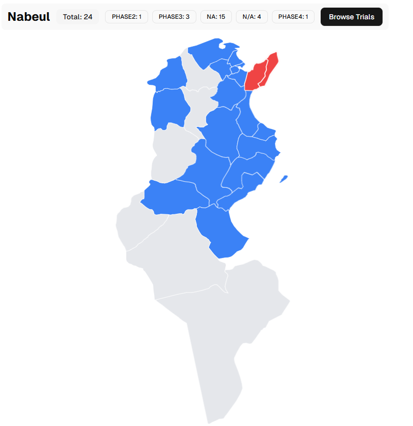

# Tunisia Clinical Trials Map

An interactive Next.js application that visualizes clinical trials conducted in Tunisia on a governorate map, and lets users browse trials by state and see detailed trial information.

## Features

- Map of Tunisia (SVG) with clickable governorates
- Client-side fetching from ClinicalTrials.gov v2 API
- Aggregations:
  - Trials per state
  - Trials per phase (per state)
  - Nationwide totals and status distribution (overallStatus)
- State listing page with pagination (10 per page)
- Trial detail page with rich metadata (titles, sponsor, status, dates, eligibility, conditions, locations)
- Polished UI using shadcn/ui + Tailwind CSS

## Tech Stack

- Next.js 14 (App Router)
- React 18
- TypeScript
- Tailwind CSS (shadcn/ui components)
- SVG map: `@svg-maps/tunisia`

## Preview

